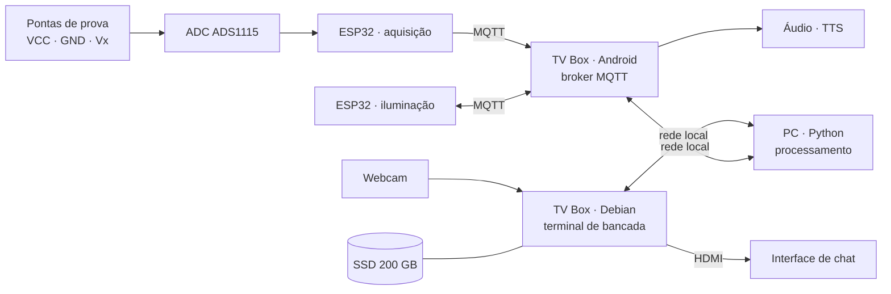

# ATENA

**Assistente Automatizado para Análise de Circuitos Eletrônicos**


> Um assistente de bancada que observa o circuito, mede o que precisa ser medido e explica em linguagem natural o que está acontecendo.

---

## Sumário

- [Motivação](#motivação)
- [Objetivo](#objetivo)
- [Escopo e delimitações](#escopo-e-delimitações)
- [Como funciona](#como-funciona)
- [Método de medição](#método-de-medição)
- [Camadas de inteligência](#camadas-de-inteligência)
- [Diagnóstico baseado em modelo](#diagnóstico-baseado-em-modelo)
- [Exemplo de interação](#exemplo-de-interação)
- [Stack tecnológica](#stack-tecnológica)
- [Cronograma](#cronograma)
- [Estrutura do repositório](#estrutura-do-repositório)
- [Referências](#referências)
- [Autor](#autor)

---

## Motivação

Em um laboratório de física ou eletrônica, o fluxo de trabalho do estudante é repetitivo e propenso a erro: posicionar as pontas de prova, ler o instrumento, largar tudo, anotar o valor, voltar. Transcrições erradas passam despercebidas, medições precisam ser refeitas, e o aluno raramente consegue medir e raciocinar sobre o circuito ao mesmo tempo.

O ATENA propõe deslocar o esforço de leitura e interpretação para o sistema, mantendo as mãos do estudante no experimento.

## Objetivo

Desenvolver um sistema assistente de bancada capaz de analisar circuitos montados em protoboard e em placas de circuito impresso. O sistema:

1. **Mede** a diferença de potencial em pontos indicados pelo usuário;
2. **Identifica opticamente** os componentes presentes no circuito, com destaque para o código de cores de resistores;
3. **Determina** corrente e resistência por cálculo, a partir da tensão medida e do valor nominal identificado;
4. **Diagnostica** discrepâncias entre o comportamento previsto e o observado, solicitando novas medições quando necessário para desambiguar hipóteses;
5. **Explica** o comportamento do circuito em linguagem natural, respondendo a perguntas do estudante.

O escopo inicial restringe-se a circuitos de **corrente contínua**.

## Escopo e delimitações

**Processamento em software.** Todo o processamento de visão, diagnóstico e diálogo é executado em Python, em um computador convencional. A implementação de aceleração em hardware dedicado foi avaliada e mantida fora do ciclo inicial: a prioridade é validar o método antes de otimizar sua execução.

**Topologia fornecida, não inferida.** A extração automática de *netlist* a partir de fotografia de protoboard permanece um problema em aberto — fios se cruzam, componentes ocultam furos e a projeção bidimensional torna conexões ambíguas. O ATENA não tenta resolvê-lo: a topologia é informada pelo roteiro de laboratório ou pelo estudante, e a câmera é empregada para **vincular valores aos elementos já conhecidos**.

**Corrente contínua apenas.** Análise em corrente alternada exigiria amostragem sincronizada e tratamento de fase.

**Posicionamento manual das pontas de prova.** O sistema não possui atuação mecânica.

**Sistema estacionário.** O ATENA opera fixo sobre a bancada.

**Iluminação controlada.** A acurácia da identificação óptica degrada sob iluminação não caracterizada — motivo pelo qual o sistema controla sua própria fonte de luz.

## Como funciona



**Divisão de responsabilidades:**

| Unidade | Responsabilidade | Por quê |
|---|---|---|
| PC | Visão computacional, resolução do circuito, diagnóstico e diálogo | Concentra o processamento pesado fora da bancada |
| ESP32 · aquisição | Leitura das pontas de prova e publicação da telemetria | GPIO abundante e conectividade sem fio integrada |
| ESP32 · iluminação | Acionamento da fonte de luz calibrada sobre a bancada | Condição de imagem reprodutível entre sessões |
| TV Box · Android | Broker MQTT e síntese de voz | Pilha de áudio madura e integrada |
| TV Box · Debian | Webcam, armazenamento e interface de chat na saída HDMI | Terminal de bancada, próximo ao experimento |
| SSD 200 GB | Dataset, parâmetros de calibração e histórico de análises | Volume incompatível com memória embarcada |

A arquitetura separa **terminal** de **processamento**: as unidades de bancada cuidam de aquisição, aquisição de imagem e interação; o computador executa a análise. Toda comunicação ocorre sobre a rede local, no padrão publicação-assinatura.

## Método de medição

A aquisição é feita por **três pontas de prova** posicionadas manualmente pelo estudante:

| Ponta | Função |
|---|---|
| **VCC** | Referência de alimentação |
| **GND** | Referência de terra |
| **Vx** | Ponto sob investigação |

A digitalização é realizada por conversor de 16 bits acoplado ao ESP32, que publica as leituras via MQTT. Simultaneamente, a webcam identifica o valor nominal dos componentes presentes no caminho. Corrente e resistência são então obtidas por aplicação da Lei de Ohm.

> **Nota de projeto.** Tensão, corrente e resistência não são grandezas ópticas — nenhuma câmera as mede diretamente. O ATENA mede **apenas tensão** e deriva as demais por cálculo. Isso representa uma vantagem prática: a medição direta de corrente exigiria interromper o circuito, o que este método dispensa.

## Camadas de inteligência

O projeto emprega aprendizado de máquina em dois pontos, cada um escolhido por necessidade e não por conveniência.

### 1. Classificador de cores

A leitura do código de cores de resistores é sensível a iluminação, ângulo e desgaste do componente. Limiares fixos em espaço HSV funcionam sob condições controladas e falham fora delas — marrom, vermelho e laranja tornam-se praticamente indistinguíveis sob luz quente.

- **Localização e segmentação:** OpenCV isola o corpo do resistor e recorta as faixas individuais
- **Entrada do classificador:** recorte de 16 × 16 px por faixa
- **Saída:** 12 classes (10 cores, dourado e prata)
- **Modelo:** rede convolucional rasa, treinada em PyTorch sobre dataset próprio
- **Desambiguação de ordem:** a faixa de tolerância determina o sentido de leitura

A métrica de sucesso é a **acurácia medida sobre conjunto de teste independente**, reportada com a matriz de confusão — as confusões entre cores próximas são o resultado mais informativo do experimento.

### 2. Camada de diagnóstico e diálogo

Um modelo de linguagem interpreta as medições e responde a perguntas do estudante em português, seguindo o padrão de **chamada de ferramentas**:

```python
medir_tensao(ponto)         # → float, volts
identificar_componente()    # → {tipo, valor, tolerância}
listar_componentes()        # → componentes visíveis no circuito
calcular_corrente(v, r)     # → float, determinístico
```

> **Restrição arquitetural.** O modelo de linguagem **não realiza cálculos**. Todo valor numérico é produzido por código determinístico e entregue ao modelo como fato. O modelo escolhe *o que* medir e explica *o que significa* — nunca estima um número. Qualquer valor gerado fora das ferramentas é tratado como falha, não como resultado.

### 3. Interface de diálogo

A interação ocorre por **chat em linguagem natural**, exibido na saída HDMI da unidade Debian e acompanhado de síntese de voz na unidade Android.

O estudante formula perguntas em português corrente — *"por que o LED não acende?"*, *"qual a corrente em R2?"* — sem necessidade de comandos estruturados. Quando as informações disponíveis são insuficientes, a resposta não é uma estimativa: o sistema indica qual medição adicional precisa ser realizada e por quê.

## Diagnóstico baseado em modelo

O núcleo conceitual do ATENA não é a medição isolada, mas o **laço iterativo entre predição e observação**. O sistema mantém um modelo do circuito, prevê o comportamento esperado, confronta a predição com uma medição real e — quando a discrepância não é conclusiva — decide qual ponto medir em seguida.

Esta abordagem inscreve-se na tradição de *diagnóstico baseado em modelo*, formalizada de maneira independente por Reiter e por De Kleer e Williams em 1987. O trabalho de De Kleer e Williams é particularmente pertinente: o *General Diagnostic Engine* foi desenvolvido tendo circuitos eletrônicos como domínio de aplicação.

### O laço de análise

```
┌─────────────────────────────────────────────────┐
│                                                 │
│  1. Topologia informada + valores identificados │
│     opticamente pela câmera                     │
│                    ↓                            │
│  2. Resolução por análise nodal                 │
│     → tensão prevista em cada nó                │
│                    ↓                            │
│  3. Confronto com a medição real em Vx          │
│                    ↓                            │
│         ┌──────────┴──────────┐                 │
│         ↓                     ↓                 │
│    consistente          discrepante             │
│         ↓                     ↓                 │
│  circuito íntegro    4. Geração de hipóteses    │
│    → explicação           de falha              │
│                              ↓                  │
│                    5. Seleção do ponto de       │
│                       maior ganho de informação │
│                              ↓                  │
│                    6. Nova medição solicitada   │
│                       ao estudante ─────────────┼──┐
│                                                 │  │
└─────────────────────────────────────────────────┘  │
                          ▲                          │
                          └──────────────────────────┘
```

### Seleção da próxima medição

Quando múltiplas hipóteses de falha permanecem compatíveis com as observações disponíveis, o sistema não solicita medições arbitrárias. O ponto escolhido é aquele que **maximiza a separação entre as hipóteses concorrentes** — o mesmo princípio que orienta o projeto ótimo de experimentos.

Na prática, para cada ponto candidato o sistema simula qual leitura cada hipótese preveria; o ponto em que as previsões mais divergem é o mais informativo, pois é o que mais reduz o espaço de hipóteses a cada medição.

### Custo computacional

A resolução de um circuito de corrente contínua reduz-se a um sistema linear de pequena ordem. A reanálise completa após cada nova medição é computacionalmente trivial, o que viabiliza um laço interativo em tempo real.

### Natureza dos métodos empregados

| Etapa | Método | Categoria |
|---|---|---|
| Leitura das faixas de cor | Classificador supervisionado | Aprendizado de máquina |
| Resolução do circuito | Análise nodal | Álgebra linear determinística |
| Geração de hipóteses de falha | Diagnóstico baseado em modelo | Raciocínio simbólico |
| Escolha da próxima medição | Maximização de ganho de informação | Teoria da decisão |
| Explicação ao estudante | Modelo de linguagem | Aprendizado de máquina |

A distinção é deliberada: a resolução do circuito é realizada por método determinístico e verificável, não por aproximação estatística. O emprego de aprendizado de máquina restringe-se às etapas em que a variabilidade do mundo real inviabiliza regras fixas.

## Exemplo de interação

```
Estudante: por que o LED não acende?

ATENA:     [chamando medir_tensao("ânodo do LED")]
           [chamando identificar_componente()]

           Não há corrente circulando pelo LED.

           O potencial no ânodo está em 0,21 V, próximo do terra,
           quando o esperado seria em torno de 2,0 V para um LED
           vermelho em condução.

           O resistor identificado é de 220 Ω, valor adequado
           para este circuito — portanto o problema não está
           no dimensionamento.

           Sugestão: verifique a continuidade entre o trilho
           positivo e o furo E12. Uma interrupção na linha de
           alimentação da protoboard explicaria esta leitura.
```

## Stack tecnológica

| Domínio | Ferramentas |
|---|---|
| Processamento | Python · NumPy · SciPy |
| Visão computacional | OpenCV · PyTorch |
| Firmware embarcado | C++ · ESP-IDF · MQTT |
| Interface | Flask · HTML/CSS · TTS (Piper) |
| Aquisição | ADC de 16 bits (ADS1115) sobre I²C |
| Mensageria | Mosquitto (MQTT) |

## Cronograma

| Período | Entrega | Estado |
|---|---|---|
| Agosto | Camada de diálogo com entrada manual de medições | ▢ |
| Agosto – Setembro | Coleta e rotulagem do dataset de faixas de resistor | ▢ |
| Setembro | Aquisição analógica: pontas de prova → ADC → MQTT | ▢ |
| Outubro | Classificador de cores e integração com a câmera | ▢ |
| Novembro | Motor de diagnóstico: análise nodal e seleção de medições | ▢ |
| Dezembro | Validação, medição de acurácia e documentação | ▢ |

**Estratégia de desenvolvimento.** Cada etapa substitui um componente simulado de um sistema que já funciona de ponta a ponta. A camada de diálogo é construída primeiro, com medições digitadas manualmente; a aquisição analógica substitui a entrada manual; a visão computacional substitui a identificação manual de componentes. Em qualquer ponto do cronograma existe uma versão demonstrável do sistema.

## Estrutura do repositório

```
atena/
├── firmware/
│   ├── aquisicao/       # ESP32 — pontas de prova e ADC
│   └── iluminacao/      # ESP32 — controle da fonte de luz
├── core/
│   ├── visao/           # Segmentação e classificação de componentes
│   ├── circuito/        # Análise nodal e modelo do circuito
│   ├── diagnostico/     # Geração de hipóteses e seleção de medições
│   └── dialogo/         # Ferramentas expostas ao modelo de linguagem
├── terminal/            # Interface Flask exibida na bancada
├── treinamento/         # Treinamento do classificador de cores
├── dataset/             # Amostras rotuladas de faixas de resistor
├── tests/               # Testes por componente
└── docs/                # Diagramas, esquemáticos e relatórios
```

## Referências

**Diagnóstico baseado em modelo**

- REITER, R. A theory of diagnosis from first principles. *Artificial Intelligence*, v. 32, n. 1, p. 57–95, 1987.
- DE KLEER, J.; WILLIAMS, B. C. Diagnosing multiple faults. *Artificial Intelligence*, v. 32, n. 1, p. 97–130, 1987.

**Análise de circuitos**

- NILSSON, J. W.; RIEDEL, S. A. *Circuitos elétricos*. 10. ed. São Paulo: Pearson, 2015.

**Visão computacional**

- BRADSKI, G.; KAEHLER, A. *Learning OpenCV*. Sebastopol: O'Reilly Media, 2008.

## Autor

**Matheus** — Engenharia de Computação, Universidade do Oeste de Santa Catarina (Unoesc), Campus de Joaçaba

---

<sub>Distribuído sob licença MIT.</sub>
